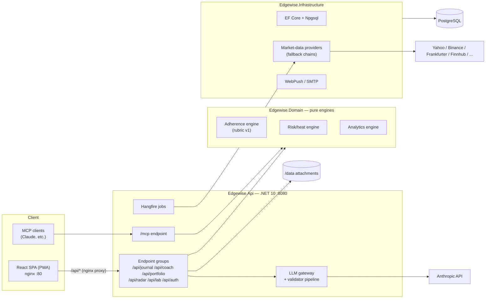

# Edgewise architecture

Edgewise is a **modular monolith**: one ASP.NET Core (.NET 10) process hosting
all pillars, one Postgres database, one SPA. Modules share a database but
communicate through domain services — no internal HTTP.

## Projects

| Project | Role |
| --- | --- |
| `Edgewise.Api` | HTTP host: endpoint groups, auth, Hangfire dashboard/server, MCP server, LLM gateway |
| `Edgewise.Domain` | Pure domain: entities and **engines** (no I/O, fully unit/property tested) |
| `Edgewise.Infrastructure` | EF Core (Npgsql), market-data providers, crypto, WebPush, SMTP, Hangfire job implementations |
| `Edgewise.Contracts` | Request/response DTOs shared with clients |

## Pillars → endpoint groups

| Pillar | Endpoints (prefix `/api`) | Notes |
| --- | --- | --- |
| Journal | `/journal/*` | plans, trades, notes, attachments (stored under `/data`), adherence grades |
| Coach | `/coach/*` | `/coach/chat` is an SSE stream through the LLM gateway |
| Portfolio | `/portfolio/*` | accounts, positions, snapshots, heat |
| Radar | `/radar/*` | watchlists, alerts, calendar, news, sentiment |
| Lab | `/lab/*` | experiments, setup analytics |
| Auth | `/auth/*` | register/login, refresh; first registered user = admin |
| Health | `/health` | liveness (used by container healthchecks) |
| MCP | `/mcp` | Model Context Protocol surface (no `/api` prefix) |

## Engine layer (pure domain)

Deterministic, side-effect-free classes in `Edgewise.Domain` — the testable core:

- **Adherence engine** — scores a trade against its plan using the versioned
  rubric ([adherence-rubric-v1](adherence-rubric-v1.md)); rubric version is
  stored with every score so historical grades never shift.
- **Risk/heat engine** — position sizing checks, portfolio heat caps,
  circuit-breaker state.
- **Analytics engine** — expectancy, streaks, setup statistics for Lab/Cockpit.

## Market data

Each asset class has a **provider chain with fallback**: try the primary, fall
through on error/rate-limit, and serve cached data marked **stale** when all
providers fail. Closed candles are immutable once persisted. Details, limits,
and the EODHD swap path: [market-data-providers.md](market-data-providers.md).

## Background jobs (Hangfire, Postgres storage)

| Job | Schedule | Purpose |
| --- | --- | --- |
| Quote refresh | every few minutes (market hours aware) | refresh watchlist/position prices |
| Candle sync | hourly | pull closed candles (immutable once stored) |
| Alert evaluation | per quote refresh | fire price/news alerts → push/email |
| Calendar sync | daily | economic calendar (Finnhub) |
| News/sentiment sync | hourly | RSS + Finnhub news, Fear & Greed (alternative.me) |
| Daily snapshot | daily (TZ-aware) | portfolio equity snapshot, streak/adherence rollups |
| Retention/cleanup | daily | expired tokens, orphaned attachments |

## LLM gateway (Coach)

All Anthropic calls go through a single gateway with a **validator pipeline**:

1. **Grounding** — prompts are built only from the user's own journal/portfolio
   data; responses must cite that grounding. Grounded-only: no external claims.
2. **No-directives** — responses are screened so the coach never issues trade
   directives ("buy X now"); it critiques process and adherence instead.
3. Failures are rejected/regenerated, never streamed through unvalidated.

Without `ANTHROPIC_API_KEY` the Coach pillar is disabled; everything else works.

## Auth

- JWT bearer auth (`EDGEWISE_JWT_SECRET`), short-lived access + refresh tokens.
- Passwords hashed with BCrypt; optional TOTP 2FA (Otp.NET).
- Sensitive columns encrypted at rest with AES using `EDGEWISE_ENCRYPTION_KEY`
  (base64, 32 bytes).
- First registered user becomes admin.

## MCP surface

`/mcp` exposes a Model Context Protocol server (streamable HTTP) so external
agents (e.g. Claude) can read journal entries, adherence stats, and portfolio
state with the user's token. Proxied unbuffered by the web container's nginx.

## Deployment shape

Three containers (see [deployment-portainer.md](deployment-portainer.md)):
`web` (nginx: SPA + proxy for `/api` and `/mcp`) → `api` (:8080, migrations
auto-run at startup with retry, attachments on the `edgewise-data` volume) →
`db` (postgres:16, `edgewise-db` volume). Only `web` publishes a host port.
